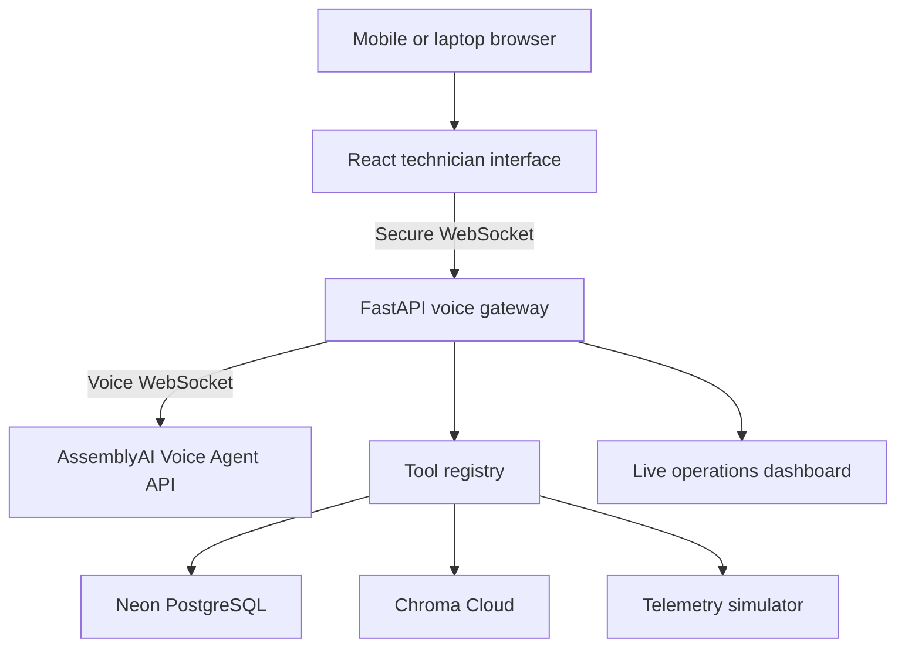

# FieldSense AI

FieldSense AI is a hands-free, voice-powered field operations assistant for qualified industrial technicians. It provides immediate access to asset history, equipment telemetry, approved technical documentation, parts inventory, and work-order automation while the technician performs physical maintenance.

This project is intended for the **AssemblyAI Voice Agent Hackathon**, running from September 1–30, 2026.

## Product positioning

FieldSense does not replace technicians or make unsupervised maintenance decisions. The technician remains responsible for physical inspection, technical judgment, safety assessment, repair execution, and final validation.

FieldSense reduces the surrounding operational burden:

- Finding equipment-specific manuals and fault-code information
- Retrieving previous maintenance and failure history
- Viewing current and baseline telemetry
- Checking parts availability
- Recording measurements and maintenance evidence by voice
- Creating and updating work orders
- Preparing a complete context package for specialist escalation

> FieldSense AI gives qualified technicians immediate access to asset intelligence and captures maintenance evidence while they work.

## Why voice is essential

Field technicians may be wearing gloves, holding tools or instruments, climbing, or working in constrained spaces. A phone can remain in a pocket or on a belt while the technician uses a Bluetooth or industrial headset.

Voice enables the technician to:

- Request information without stopping physical work
- Record readings at the moment they are observed
- Receive one instruction or checklist item at a time
- Interrupt or correct the agent naturally
- Escalate immediately when site conditions change

The hackathon demonstration can use a laptop or smartphone microphone. A production version could use a noise-cancelling, helmet-mounted, hearing-protection-compatible, or push-to-talk industrial headset.

## Hackathon alignment

### Application of Technology

- AssemblyAI real-time voice interaction
- Universal-3 Pro speech-to-text, as specified by the challenge
- Turn-taking and voice activity detection
- Barge-in and conversational correction
- JSON-Schema tool calling
- Tool results converted into natural spoken responses

### Presentation

- Clear alarm-to-resolution story
- Visible tool calls and telemetry
- A memorable interruption and safety escalation
- A completed work order at the end of the demonstration

### Business Value

- Reduced time spent searching across operational systems
- Faster access to asset-specific organizational knowledge
- More complete maintenance records
- Faster specialist escalation
- Reduced equipment downtime

### Originality

FieldSense combines voice interaction, live asset context, retrieval from approved manuals, maintenance-system actions, evidence capture, and human-controlled safety workflows.

## MVP boundary

Build only the following for the hackathon:

- One equipment type: industrial air compressor
- Three sample compressor assets
- Three deterministic fault scenarios
- One synthetic or openly licensed equipment manual
- Simulated telemetry
- Simulated maintenance history
- Simulated parts inventory
- Work-order creation and completion
- Manual/runbook RAG
- Voice interaction using AssemblyAI Voice Agent API
- Mobile-friendly technician interface
- Judge-facing live operations dashboard

Do not integrate real industrial hardware, production systems, Informatica, Control-M, Kafka, or proprietary manuals for the MVP.

## Demo scenarios

### Scenario 1: Repeated overheating

The agent correlates elevated temperature with maintenance history and discovers that the intake filter is overdue for replacement.

### Scenario 2: Dangerous vibration

The agent detects a reading beyond the permitted limit, stops routine troubleshooting, and escalates the case to a specialist.

### Scenario 3: Low discharge pressure

The agent combines telemetry, previous work history, and manual guidance to identify a probable air leak.

## Primary demonstration script

1. The technician selects or scans asset `AC-104`.
2. The technician says, “FieldSense, compressor AC-104 has stopped. The panel shows fault E27.”
3. The agent retrieves asset details, current telemetry, maintenance history, and the relevant manual section.
4. The agent explains the evidence and proposes the next observation.
5. The technician records a measurement verbally.
6. The agent creates a work order and records the evidence.
7. While the agent is speaking, the technician interrupts: “Wait—the motor temperature has increased to 105 degrees.”
8. The agent stops the routine flow, changes the risk classification, and triggers the safety-escalation path.
9. The agent prepares a specialist handover containing the asset, symptoms, readings, history, sources, and actions already taken.
10. The dashboard displays the complete incident timeline and tool audit trail.

## Safety model

| Classification | Agent behavior |
| --- | --- |
| Observation | Retrieve information and record measurements |
| Low-risk inspection | Present approved checklist items one at a time |
| Lockout required | Require explicit confirmation that the site procedure was completed and independently verified |
| Specialist required | Stop procedural guidance and escalate |
| Dangerous condition | Instruct the technician to move away and follow the site's emergency procedure |

The agent must never claim that verbal confirmation proves a physical environment is safe. It must not bypass site procedures, provide unapproved repair instructions, or execute safety-critical physical actions.

## Architecture



### Runtime interaction

1. The browser captures microphone audio.
2. The frontend sends audio through a secure WebSocket to the backend.
3. The backend maintains the AssemblyAI Voice Agent API connection.
4. AssemblyAI handles speech-to-text, LLM routing, voice output, voice activity detection, and turn-taking.
5. AssemblyAI emits JSON-Schema tool calls.
6. The backend validates and executes tool calls.
7. Tool results are returned to the voice session.
8. AssemblyAI generates the spoken response.
9. The backend publishes transcripts, telemetry, tool activity, and timeline events to the dashboard.

The AssemblyAI API key must remain in the backend. Never expose a long-lived API key in frontend JavaScript or commit it to GitHub.

## Chosen technology stack

| Layer | Choice | Hosting |
| --- | --- | --- |
| Frontend | React, Vite, TypeScript | Vercel |
| Backend | Python, FastAPI | Railway |
| Application database | PostgreSQL | Neon |
| RAG/vector database | Chroma | Chroma Cloud |
| Voice AI | AssemblyAI Voice Agent API | Managed by AssemblyAI |
| Source repository | Monorepo | Public GitHub |
| Development assistant | Claude Code | Used milestone by milestone |

### Simplification fallback

If managing separate frontend and backend deployments slows delivery, compile the React application and serve it from FastAPI. Deploy the combined application on Railway with one public URL. Keep Neon, Chroma Cloud, and AssemblyAI as managed services.

## Data responsibilities

### Neon PostgreSQL

Store structured operational data:

- Assets
- Asset models
- Telemetry readings
- Fault history
- Maintenance records
- Parts inventory
- Work orders
- Work-order events
- Voice-session metadata
- Tool audit logs

Suggested initial tables:

```text
assets
asset_models
telemetry
fault_history
maintenance_records
parts_inventory
work_orders
work_order_events
voice_sessions
tool_audit_log
```

Use SQLite for local tests only if helpful. Use PostgreSQL for the deployed application so data survives redeployment.

### Chroma Cloud

Store retrievable knowledge:

- Manual chunks
- Troubleshooting procedures
- Safety instructions
- Fault-code documentation
- Embeddings
- Source metadata

Every chunk should retain metadata similar to:

```json
{
  "equipment_type": "air_compressor",
  "manufacturer": "DemoAir",
  "model": "ACX-200",
  "document": "ACX-200 Service Manual",
  "section": "Fault E27",
  "page": 42,
  "content_type": "troubleshooting"
}
```

Retrieval must first identify the asset model and then filter searches to the correct model. Do not search all equipment manuals without a model filter.

## Initial tool contracts

Implement these tools using JSON Schema:

```text
get_asset_details(asset_id)
get_live_telemetry(asset_id)
get_maintenance_history(asset_id)
search_manual(asset_model, fault_code, question)
check_parts_inventory(site_id, part_number)
create_work_order(asset_id, problem, priority)
record_observation(work_order_id, measurement, value, unit)
escalate_to_specialist(asset_id, reason, work_order_id)
complete_work_order(work_order_id, resolution)
```

Requirements for every tool:

- Strictly validate input against its schema.
- Return structured JSON rather than preformatted prose.
- Use deterministic synthetic data for the MVP.
- Emit an audit event containing tool name, sanitized arguments, result status, session ID, and timestamp.
- Return a safe structured error when data is missing or invalid.
- Never allow the language model to directly perform a physical or safety-critical action.

## User interface

### Technician view

- Start and stop voice session
- Microphone permission and connection status
- Listening, thinking, speaking, and tool-running state
- Current asset and fault
- Live transcript
- Current diagnostic or checklist step
- Safety warnings
- Work-order status
- Text controls as a fallback for demo reliability

### Operations dashboard

- Asset details
- Simulated live telemetry
- Maintenance history
- Tool calls, arguments, and results
- Retrieved manual sources
- Incident timeline
- Risk classification
- Proposed or completed actions
- Escalation and work-order status

## Hosting and configuration

### Preferred deployment

```text
React/Vite frontend       -> Vercel
FastAPI backend           -> Railway
Structured data           -> Neon PostgreSQL
RAG/vector search         -> Chroma Cloud
Voice                     -> AssemblyAI Voice Agent API
```

### Required environment variables

```text
ASSEMBLYAI_API_KEY=
DATABASE_URL=
CHROMA_API_KEY=
CHROMA_TENANT=
CHROMA_DATABASE=
ALLOWED_ORIGINS=
APP_ENV=
```

Provide `.env.example` with empty values. Never commit `.env` or real credentials.

### Hosting requirements

- Public HTTPS application URL
- Secure WebSocket support
- Backend capable of maintaining long-lived WebSocket connections
- Configured frontend origin/CORS allowlist
- Health endpoint for the backend
- No dependency on a developer laptop remaining online
- Clear degraded-state UI if AssemblyAI, PostgreSQL, or Chroma is unavailable

Local execution is valid for development, testing, and recording a backup demonstration. It is not the final submitted application URL.

## Suggested repository structure

```text
fieldsense-ai/
├── README.md
├── CLAUDE.md
├── .env.example
├── .gitignore
├── backend/
│   ├── app.py
│   ├── assemblyai_gateway.py
│   ├── session_manager.py
│   ├── tool_registry.py
│   ├── database.py
│   ├── models.py
│   ├── tools/
│   │   ├── asset_tools.py
│   │   ├── telemetry_tools.py
│   │   ├── manual_tools.py
│   │   └── work_order_tools.py
│   ├── data/
│   │   ├── seed_data.json
│   │   └── manuals/
│   └── tests/
├── frontend/
│   ├── src/
│   └── package.json
└── docs/
    ├── architecture.md
    ├── milestones.md
    ├── demo-script.md
    └── submission-content.md
```

Do not create all modules prematurely. Begin with the smallest vertical slice and split modules only as responsibilities become concrete.

## Development milestones

See `docs/milestones.md` for calendar dates against the hackathon's
Sep 30, 8:30 PM IST deadline and which judging criteria each
milestone feeds.

### Milestone 0: Repository and instructions

- Initialize public-ready Git repository.
- Add this README.
- Add `CLAUDE.md` containing persistent Claude Code rules.
- Add `.env.example` and credential-safe `.gitignore`.
- Add minimal local run and test commands.

### Milestone 1: Thin vertical slice

- One asset: `AC-104`
- One deterministic telemetry tool
- One manual lookup result
- One work-order creation
- Minimal browser UI
- Automated backend tests

The milestone is complete only when one request can traverse the UI, backend, tools, and database without AssemblyAI.

### Milestone 2: AssemblyAI voice loop

- Establish the Voice Agent API session.
- Stream microphone input.
- Play returned audio.
- Display transcript and agent state.
- Handle disconnects and expose clear connection errors.

### Milestone 3: Tool calling

- Register strict JSON-Schema tools.
- Receive tool calls from AssemblyAI.
- Validate and execute them.
- Return structured results.
- Display tool activity on the dashboard.

### Milestone 4: RAG

- Ingest the selected manual.
- Store chunks and metadata in Chroma.
- Filter retrieval by asset model.
- Return document, section, page, and text with every result.
- Display sources on the dashboard.

### Milestone 5: Complete demo scenarios

- Implement overheating.
- Implement dangerous vibration.
- Implement low pressure.
- Add deterministic simulator controls.

### Milestone 6: Safety and interruption

- Implement risk classification.
- Test barge-in while the agent is speaking.
- Change the flow when telemetry becomes dangerous.
- Require explicit confirmation for controlled operations.
- Generate a structured specialist handover.

### Milestone 7: Deployment

- Deploy backend and verify WebSockets.
- Deploy frontend and configure HTTPS/WSS endpoints.
- Configure Neon, Chroma Cloud, and secrets.
- Seed synthetic data.
- Run the full demo from a clean browser and mobile device.

### Milestone 8: Submission

- Public GitHub repository
- Public application URL
- Project title and descriptions
- Technology and category tags
- Cover image
- Slide presentation
- Video presentation
- Architecture diagram
- Tested backup video

## Target schedule

| Dates | Target |
| --- | --- |
| Sep 5–7 | Repository, instructions, UI skeleton, and seed data |
| Sep 8–10 | Basic AssemblyAI voice conversation |
| Sep 11–14 | Tool calling and live dashboard |
| Sep 15–17 | First complete fault scenario |
| Sep 18–20 | Remaining scenarios and RAG |
| Sep 21–23 | Safety, interruption, and failure handling |
| Sep 24–25 | Public deployment |
| Sep 26–27 | Cover image, slides, and submission copy |
| Sep 28–29 | Final recording and clean-environment testing |
| Sep 30 | Submission buffer |

## Testing strategy

### Automated tests

- Tool schema validation
- Valid and invalid asset IDs
- Telemetry scenarios
- Model-filtered manual retrieval
- Work-order state transitions
- Safety escalation rules
- Database failures
- Tool timeouts and structured errors

### Manual tests

- Microphone permission denied
- AssemblyAI connection failure
- User interrupts agent speech
- User changes a measurement mid-flow
- Ambiguous asset identifier
- Dangerous reading escalation
- Page reload and session recovery
- Mobile browser layout
- Deployed HTTPS and WSS behavior

## Definition of done

A judge can:

1. Open a public application URL.
2. Start a voice session.
3. Select asset `AC-104`.
4. Report fault `E27`.
5. Watch the agent call multiple tools.
6. See model-specific manual evidence.
7. Interrupt and correct the agent naturally.
8. Introduce a dangerous telemetry reading.
9. Observe the agent stop and escalate safely.
10. View a completed work order, specialist handover, and audit timeline.
11. Review the public GitHub repository and setup documentation.

## Claude Code working agreement

Claude Code should follow these rules throughout development:

1. Work on one milestone at a time.
2. Before editing, inspect the repository and state the smallest proposed change.
3. Do not add features outside the MVP without explicit approval.
4. Keep tool outputs structured and deterministic.
5. Keep credentials server-side and never commit secrets.
6. Add or update tests with every behavior change.
7. Run relevant tests and report their results before completing a task.
8. Preserve existing working behavior and avoid unrelated refactoring.
9. Prefer simple implementations suitable for a reliable hackathon demo.
10. Update the Progress Log and Next Task after completing a milestone.

## Progress log

| Date | Milestone | Status | Evidence/notes |
| --- | --- | --- | --- |
| 2026-09-05 | Product definition and architecture | Complete | README created |
| 2026-09-06 | Milestone 0 | Complete | git init + first commit; CLAUDE.md, .gitignore, .env.example, dev.md added |
| 2026-09-06 | Milestone 1 | Complete | FastAPI backend (SQLite, tool_registry, 4 tools) + React/Vite/TS frontend; 8/8 pytest passing; verified end-to-end in a real browser |

## Next task

Complete **Milestone 2: AssemblyAI voice loop**. See `tasks.md` for the task list.

## First prompt to give Claude Code

```text
Read README.md completely and treat it as the product source of truth. Inspect the current repository before making changes. Implement Milestone 0 only: establish the minimal repository structure, create CLAUDE.md with the Claude Code working agreement and MVP constraints from the README, add a safe .gitignore and .env.example, and document exact local run/test commands. Do not scaffold unnecessary modules or start AssemblyAI integration. Run all available validation, update the README Progress Log and Next Task, and summarize the files changed and any unresolved decisions.
```

## Reference links

- AssemblyAI documentation: https://www.assemblyai.com/docs
- AssemblyAI Voice Agent API: https://www.assemblyai.com/products/voice-agent-api
- Hackathon: https://lablab.ai/ai-hackathons/assemblyai-voice-agent-hackathon
- Railway FastAPI guide: https://docs.railway.com/guides/fastapi
- Chroma Cloud: https://docs.trychroma.com/cloud/getting-started
- Chroma pricing: https://www.trychroma.com/pricing
- Neon connection guide: https://neon.com/docs/connect/connection-pooling

