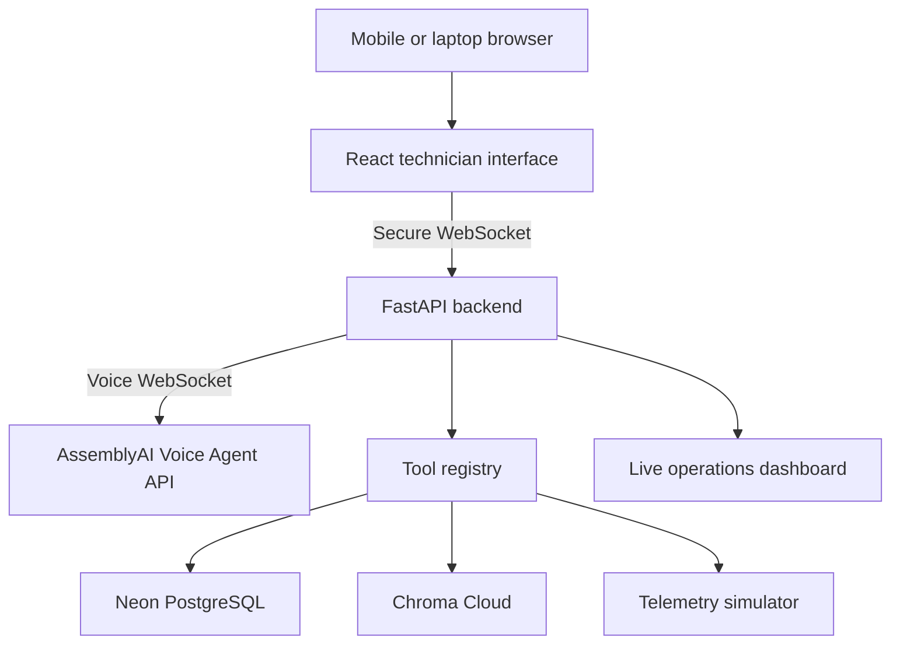

# FieldSense AI — Architecture

This document expands the architecture summary in `README.md` into a
standalone reference for contributors, Claude Code, and hackathon judges.
It should stay consistent with the README; if the two disagree, treat
the README's MVP boundary as the source of truth and update this file.

## 1. System overview

FieldSense AI has four cooperating tiers:

1. **Client** — a React/Vite technician interface running in a mobile
   or laptop browser. Captures microphone audio and renders voice
   session state, transcripts, and work-order status.
2. **Backend** — a single FastAPI service that is the hub for every
   other tier. It holds the persistent AssemblyAI voice connection,
   owns the tool registry, and publishes events to the dashboard.
3. **Voice AI** — the AssemblyAI Voice Agent API, which is
   responsible for speech-to-text, LLM-driven turn-taking, tool-call
   emission, and text-to-speech.
4. **Data & knowledge services** — Neon PostgreSQL for structured
   operational data, Chroma Cloud for manual/runbook retrieval, and a
   simulated telemetry generator for deterministic sensor readings.



The backend is intentionally the only component that talks directly
to AssemblyAI, Neon, or Chroma. The frontend never holds credentials
and never calls those services directly — everything flows through
the backend's WebSocket and REST endpoints. This keeps the
`ASSEMBLYAI_API_KEY`, `DATABASE_URL`, and `CHROMA_API_KEY` server-side
only, per the README's non-negotiable rule.

## 2. Component responsibilities

| Component | Responsibility |
| --- | --- |
| React technician interface | Start/stop voice session, show connection and listening/thinking/speaking state, display transcript, current asset/fault, checklist step, safety warnings, work-order status. Includes a text fallback for demo reliability. |
| FastAPI voice gateway (`assemblyai_gateway.py`) | Establishes and maintains the AssemblyAI Voice Agent API session; streams mic audio in, plays synthesized audio out. |
| Session manager (`session_manager.py`) | Tracks per-technician voice session state (current asset, risk classification, active work order) across the conversation. |
| Tool registry (`tool_registry.py`, `tools/`) | Validates incoming JSON-Schema tool calls, executes them against the data layer, returns structured results, and emits audit events. Never allows the LLM to perform a physical or safety-critical action directly. |
| Neon PostgreSQL | System of record for assets, telemetry, fault/maintenance history, parts inventory, work orders, work-order events, voice-session metadata, and the tool audit log. |
| Chroma Cloud | Vector store for manual chunks, troubleshooting procedures, safety instructions, and fault-code documentation, filtered by asset model before search. |
| Telemetry simulator | Produces deterministic, scenario-driven sensor readings (temperature, vibration, discharge pressure) so demo scenarios are repeatable. |
| Live operations dashboard | Judge-facing view of asset details, live telemetry, tool calls and results, retrieved manual sources, incident timeline, risk classification, and escalation/work-order status. |

## 3. Runtime interaction (per request)

1. The browser captures microphone audio.
2. The frontend streams audio to the backend over a secure WebSocket.
3. The backend forwards audio to AssemblyAI over its own voice
   WebSocket connection.
4. AssemblyAI performs STT, routes to its LLM, handles voice activity
   detection and turn-taking, and emits a JSON-Schema tool call when
   the model decides more information or an action is needed.
5. The backend validates the tool call's arguments against its
   schema and executes it via the tool registry, hitting Neon,
   Chroma, or the telemetry simulator as appropriate.
6. The structured tool result is returned to the AssemblyAI voice
   session.
7. AssemblyAI turns the result into a spoken response and streams
   audio back through the backend to the browser.
8. In parallel, the backend publishes the transcript, telemetry
   snapshot, tool call/result, and any timeline event to the
   dashboard.

This loop repeats for every technician utterance, including
mid-response interruptions (barge-in), which AssemblyAI surfaces to
the backend so the session manager can re-classify risk and change
flow — see Section 5.

### 3.1 Backend → dashboard transport

The README's runtime interaction step 8 doesn't name a transport for
this hop, so it's specified here: **a dedicated WebSocket endpoint**
(e.g. `/ws/dashboard`), separate from the technician's `/ws/voice`
connection, using the same connection-handling code the voice path
already needs. The backend keeps an in-memory set of connected
dashboard sockets in `session_manager.py` and broadcasts to all of
them whenever something audit-worthy happens. Server-Sent Events was
considered (the dashboard is read-only) but rejected to avoid a
second real-time transport pattern in a time-boxed build — one
WebSocket implementation to reason about and debug beats two.

What gets published, and why:

| Event | Purpose |
| --- | --- |
| Live transcript | Lets a judge follow the conversation without needing audio |
| Telemetry snapshot | Shows sensor readings updating live, including the moment a reading crosses into dangerous territory |
| Tool calls, arguments, results | Visible proof the agent is grounded in real data — the "visible tool calls" requirement |
| Retrieved manual sources | Shows the RAG pipeline is filtering by asset model and citing real content |
| Risk classification | The safety tier, updated live as it changes |
| Incident timeline | Ties everything into one chronological story for the demo script |
| Work-order / escalation status | The concrete outcome artifact at the end of the demo |

Telemetry ticks should be throttled to roughly 1/sec before
publishing — the simulator can update faster than that, but pushing
every tick to the dashboard causes UI thrash with no added judge
value. Tool-call and timeline events publish immediately, uncoalesced.

## 4. Tool contracts

All tools are registered with strict JSON Schema and live under
`backend/tools/`:

```text
get_asset_details(asset_id)
get_live_telemetry(asset_id)
get_maintenance_history(asset_id)
search_manual(asset_model, fault_code, question)
check_parts_inventory(site_id, part_number)
create_work_order(asset_id, problem, priority)
record_observation(work_order_id, measurement, value, unit)
escalate_to_specialist(asset_id, reason, work_order_id)
complete_work_order(work_order_id, resolution)
```

Every tool implementation must:

- Validate input strictly against its schema.
- Return structured JSON, never preformatted prose (AssemblyAI/the
  LLM turns it into speech).
- Use deterministic synthetic data for the MVP.
- Emit an audit event (tool name, sanitized arguments, result
  status, session ID, timestamp) to `tool_audit_log`.
- Return a safe structured error on missing/invalid data or timeout.
- Never perform a physical or safety-critical action itself.

## 5. Safety model

Risk classification is tracked per session and can change mid-turn
(e.g. on a barge-in with a dangerous reading):

| Classification | Agent behavior |
| --- | --- |
| Observation | Retrieve information and record measurements |
| Low-risk inspection | Present approved checklist items one at a time |
| Lockout required | Require explicit confirmation that the site procedure was completed and independently verified |
| Specialist required | Stop procedural guidance and escalate |
| Dangerous condition | Instruct the technician to move away and follow the site's emergency procedure |

The agent must never claim that verbal confirmation proves a physical
environment is safe, bypass site procedures, give unapproved repair
instructions, or execute a safety-critical physical action. The
`escalate_to_specialist` tool packages asset, symptoms, readings,
history, sources, and actions-already-taken into a structured
handover — this is the artifact judges see at the end of the demo
script.

## 6. Data layer

### Neon PostgreSQL — suggested tables

```text
assets
asset_models
telemetry
fault_history
maintenance_records
parts_inventory
work_orders
work_order_events
voice_sessions
tool_audit_log
```

Use PostgreSQL for the deployed app so state survives redeploys;
SQLite is acceptable for local tests only.

### Chroma Cloud — chunk metadata

Retrieval always filters by asset model first — never search all
equipment manuals unfiltered. Each chunk carries metadata like:

```json
{
  "equipment_type": "air_compressor",
  "manufacturer": "DemoAir",
  "model": "ACX-200",
  "document": "ACX-200 Service Manual",
  "section": "Fault E27",
  "page": 42,
  "content_type": "troubleshooting"
}
```

## 7. Deployment topology

| Layer | Choice | Hosting |
| --- | --- | --- |
| Frontend | React, Vite, TypeScript | Vercel |
| Backend | Python, FastAPI | Railway |
| Application database | PostgreSQL | Neon |
| RAG/vector database | Chroma | Chroma Cloud |
| Voice AI | AssemblyAI Voice Agent API | Managed by AssemblyAI |

**Fallback:** if managing separate deployments slows delivery, build
the React app and serve it from FastAPI as one Railway service with
one public URL. Neon, Chroma Cloud, and AssemblyAI stay as managed
services regardless.

Hosting must provide: a public HTTPS URL, secure WebSocket support,
a backend able to hold long-lived WebSocket connections, a configured
CORS/frontend-origin allowlist, a health endpoint, and a clear
degraded-state UI if AssemblyAI, Postgres, or Chroma is unreachable.
Local execution is for development and a backup recording only — it
is not the submitted application URL.

### Environment variables

```text
ASSEMBLYAI_API_KEY=
DATABASE_URL=
CHROMA_API_KEY=
CHROMA_TENANT=
CHROMA_DATABASE=
ALLOWED_ORIGINS=
APP_ENV=
```

Ship a `.env.example` with empty values; never commit `.env` or real
credentials.

### Estimated hosting cost (hackathon build)

| Service | Plan | Cost |
| --- | --- | --- |
| Vercel | Hobby | $0/mo (personal/non-commercial project, which a hackathon submission is) |
| Neon | Free | $0/mo (100 CU-hours + 0.5 GB/project comfortably covers 3 synthetic assets) |
| Chroma Cloud | Starter | $0/mo + usage (one synthetic manual stays well within the $5 free credit) |
| Railway | Hobby | $5/mo base (the only service holding a long-lived, always-on process) |

Total realistic spend for the month: **~$5**, plus AssemblyAI Voice
Agent API usage (billed hourly per session — check current voice
minutes against AssemblyAI's own pricing separately, since that
meter is independent of the four services above).

## 8. MCP — not part of this architecture

The Model Context Protocol (MCP) is intentionally absent from the
runtime system. AssemblyAI's Voice Agent API calls tools through its
own native JSON-Schema function-calling events (`tool.call` /
`tool.result`) over the voice WebSocket — a different, simpler
mechanism than MCP, and the one the tool registry (Section 4) is
built around. Adding an MCP layer between AssemblyAI and the backend
would introduce a third protocol for no functional gain.

MCP does show up on the *development* side, not the app: AssemblyAI
publishes a documentation MCP server so a coding assistant can look
up current API details instead of relying on training data (`claude
mcp add assemblyai-docs --transport http https://mcp.assemblyai.com/docs`).
That's a one-time addition to the Claude Code dev environment, not
something that touches the submitted application or its diagrams.

## 9. Explicit non-goals (MVP boundary)

Do not integrate real industrial hardware, production systems,
Informatica, Control-M, Kafka, or proprietary manuals. Scope is one
equipment type (industrial air compressor), three sample assets, and
three deterministic fault scenarios, per the README.
